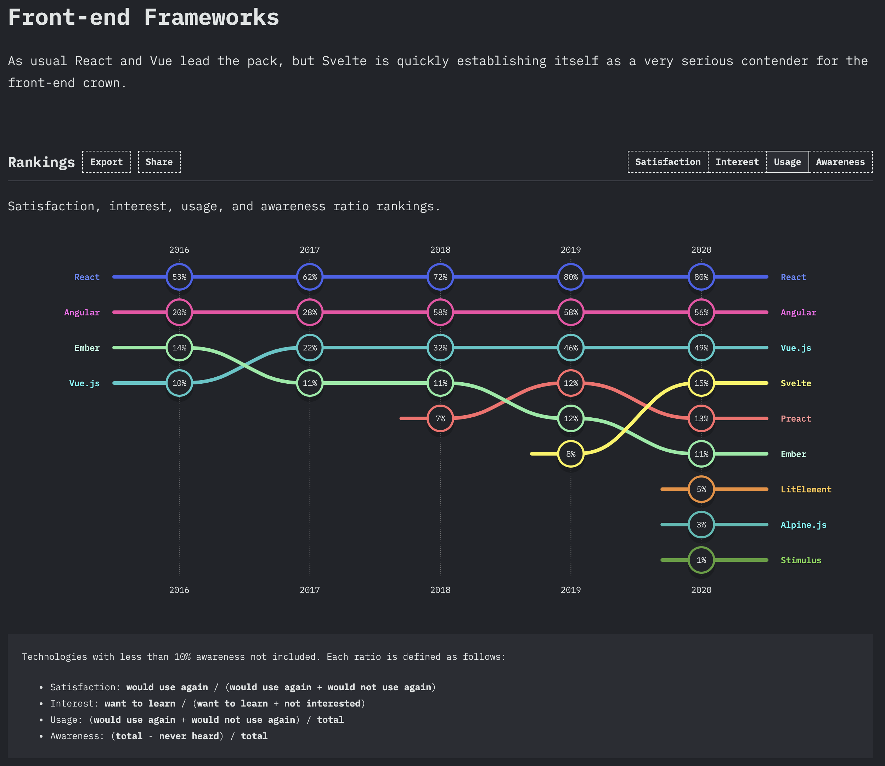

<!-- section-title: React Intro -->

# React

A JavaScript library for building user interfaces

<br />
<br />

<!-- block-start: grid -->

<!-- block-start: column,textAlignStart -->

##### Declarative
<br />
React makes it painless to create interactive UIs. Design simple views for each state in your application, and React will efficiently update and render just the right components when your data changes.
<br />
<br />
Declarative views make your code more predictable and easier to debug.

<!-- block-end -->

<!-- block-start: column -->

##### Component-Based
<br />
Build encapsulated components that manage their own state, then compose them to make complex UIs.
<br />
<br />
Since component logic is written in JavaScript instead of templates, you can easily pass rich data through your app and keep state out of the DOM.

<!-- block-end -->

<!-- block-start: column -->

##### Learn Once, Write Anywhere
<br />
We don’t make assumptions about the rest of your technology stack, so you can develop new features in React without rewriting existing code.

<!-- block-end -->

<!-- block-end -->

<br />
<br />
<br />

*Disclaimer: This content is copied from the React Website, https://reactjs.org*

---

# Basic React Component

```jsx
function MyComponent() {
  return <button onClick={() => alert("Hello World!")}>Click Me!</button>;
}
```

<br />
<br />

<button onClick={() => alert("Hello World!")}>Click me!</button>

---

# Why React?

[](https://2020.stateofjs.com/en-US/technologies/front-end-frameworks/)

<br />

- React has been the most used JS Framework for years
- Huge Ecosystem and Community