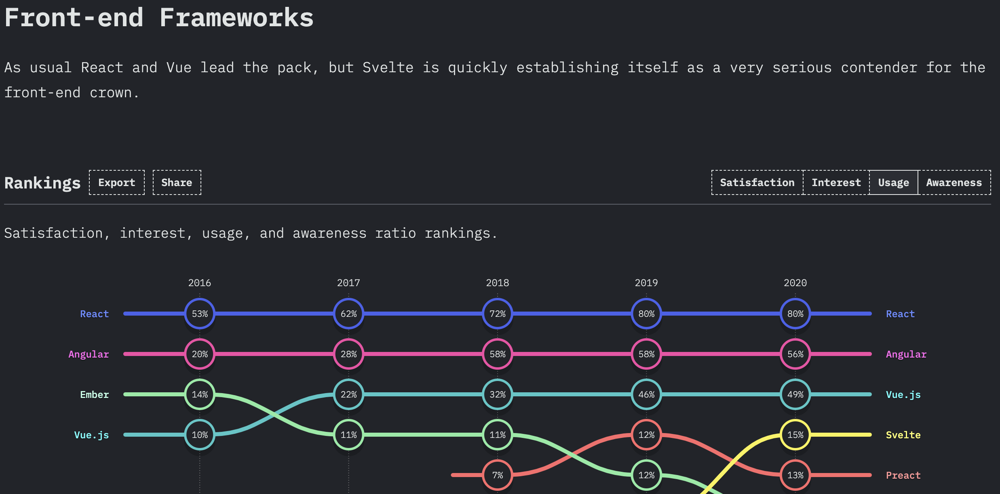

<!-- section-title: React Intro -->

# React

<br />

A JavaScript library for building user interfaces

<br />
<br />

React helps you to write declarative, component based UIs by using the (optional) JSX syntax.

<br />

```jsx
function MyComponent() {
  return <button onClick={() => alert("Hello World!")}>Click Me!</button>;
}
```

<br />

If you render this component, it will look like this:

<button onClick={() => alert("Hello World!")}>Click me!</button>

---

## Why React?

<br />

- React has been the most used JS Framework for years
- Huge Ecosystem and Community

<br />


_Screenshot taken from https://2020.stateofjs.com/en-US/technologies/front-end-frameworks/, Feb 12th, 2021_
