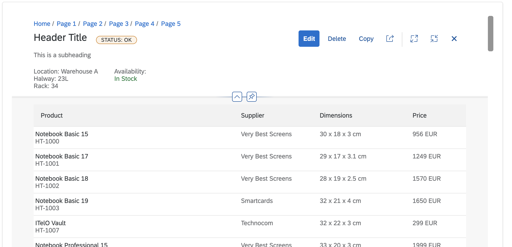
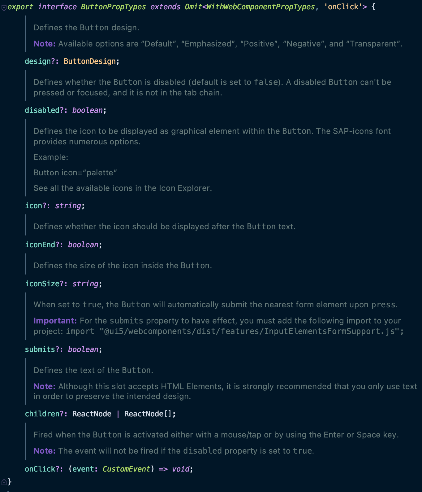
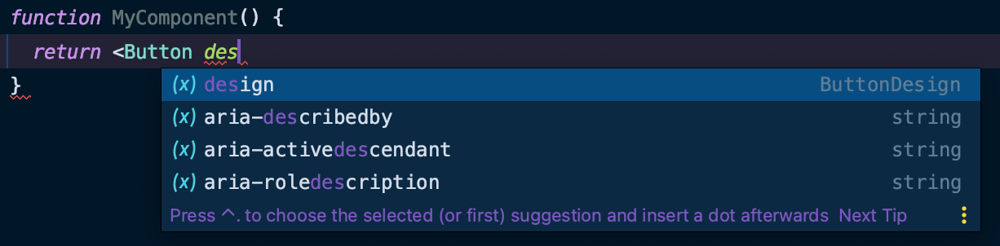

import {Button, Calendar, Label } from "@ui5/webcomponents-react";

<!-- section-title: UI5 Web Components for React -->


---

# What does UI5 Web Components for React offer?

- provides Wrapper Components for all UI5 Web Components
- provides complex layouts (e.g. `ObjectPage`) and charts built on top of UI5 Web Components
- Type Definitions for all components

---

# Wrapper Components

Our Wrapper components are hiding the complexity of dealing with Custom Elements in React and let you use the UI5 Web Components
in React as if they were "regular" React Components.

<!-- fragments-start -->

<!-- fragments-end -->

---

<!-- begin-block -->

## Boolean Prop Handling

```jsx
import { Button } from "@ui5/webcomponents-react";

function MyComponent() {
  return (
    <>
      <Button onClick={() => alert("I'll be there onClick!")} disabled={false}>
        Click me!
      </Button>
      <Button onClick={() => alert("I will never show up!")} disabled={true}>
        But you can't click me!
      </Button>
    </>
  );
}
```

<div className="scaledFlexBox">
    <Button onClick={() => alert("I'll be there onClick!")} disabled={false}>
        Click me!
    </Button>
    <Button onClick={() => alert("I will never show up!")} disabled={true}>
        But you can't click me!
    </Button>
</div>

<!-- end-block -->

---
<!-- start-block -->

## Event Handlers

```javascript
import { Calendar } from "@ui5/webcomponents-react";

function MyComponent() {
  return (
    <Calendar
      onSelectedDatesChange={(e) => {
        e.detail.dates.forEach((d) => alert(new Date(d * 1000)));
      }}
    />
  );
}
```
<br/>
<br/>
<br/>
<br/>
<div className="scaledFlexBox">
    <Calendar
        onSelectedDatesChange={(e) => {
            e.detail.dates.forEach((d) => alert(new Date(d * 1000)));
        }}
    />
</div>

<!-- end-block -->

---

## Support for standard HTML props

```jsx
import { Label } from '@ui5/webcomponents-react';

function MyComponent() {
  return <Label className="textColorRed">I'm a text!</Label>;
}
```

<div className="scaledFlexBox">
    <Label className="textColorRed">I'm a text!</Label>
</div>

<br />
<br />
<br />
<br />

In addition to fixing the `className` issue, our components are also passing through all `aria-`, `data-` and event handler
attributes.

---

# Complex Layouts and Charts

<!-- block-start: grid -->
<!-- block-start: column -->

<!-- block-end -->
<!-- block-end -->


---

# Type Definitions

<!-- block-start: grid -->
<!-- block-start: column -->

<!-- block-end -->

<!-- block-start: column -->

<!-- block-end -->
<!-- block-end -->

---

<!-- classes: demo -->

<!-- block-start: attribution -->
[Source](http://gph.is/1LmxrD8)
<!-- block-end -->

<!-- section-title: Demo -->
# Demo

---

# Thank you!

### Links:

- [Github Repository](https://github.com/SAP/ui5-webcomponents-react)
- [Documentation](https://sap.github.io/ui5-webcomponents-react)

<br />
<br />
<br />

### Contact:

<!-- block-start: grid -->
<!-- block-start: column -->
###### Marcus Notheis

marcus.notheis@sap.com

<!-- block-start: social -->
[](https://github.com/MarcusNotheis)

[](https://twitter.com/marcusnotheis)
<!-- block-end -->

<!-- block-end -->

<!-- block-start: column -->
###### Lukas Harbarth

lukas.harbarth@sap.com

<!-- block-start: social -->
[](https://github.com/Lukas742)

[](https://twitter.com/luk742)
<!-- block-end -->

<!-- block-end -->
<!-- block-end -->


